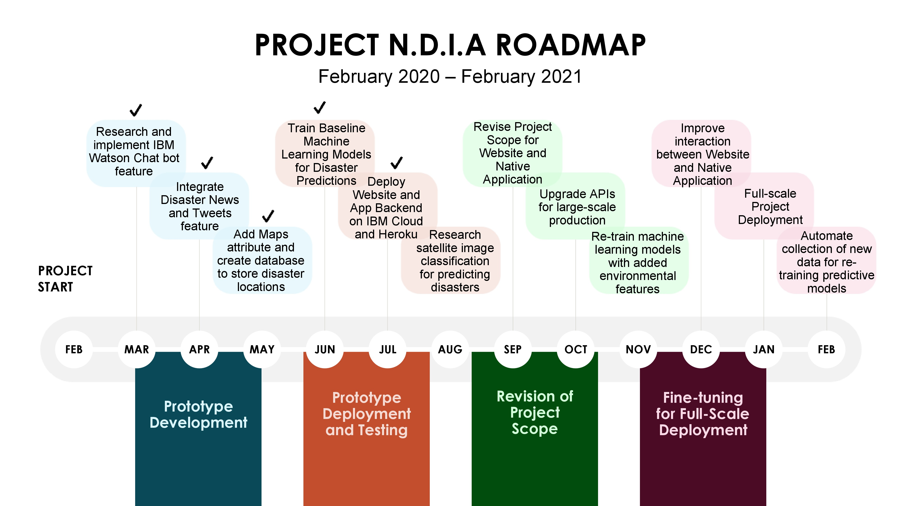

# Natural Disaster Informant and Assistant (N.D.I.A)

[](https://www.apache.org/licenses/LICENSE-2.0) [](https://code-and-response.github.io/Project-Sample/)

GitHub repository for Project N.D.I.A (Natural Disaster Informant and Assistant), our proposed solution for the Call for Code 2020 Competition on halting the effects of Climate Change.

*Read this in other languages: [English](README.md), [한국어](README.ko.md), [português](README.pt_br.md).*

## Contents

1. [Short description](#short-description)
1. [Demo video](#demo-video)
1. [The architecture](#the-architecture)
1. [Long description](#long-description)
1. [Project roadmap](#project-roadmap)
1. [Getting started](#getting-started)
1. [Running the tests](#running-the-tests)
1. [Live demo](#live-demo)
1. [Built with](#built-with)
1. [Contributing](#contributing)
1. [Authors](#authors)
1. [License](#license)
1. [Acknowledgments](#acknowledgments)

## Short description

### The Ongoing Natural Disaster Conundrum

Natural disasters continue to unfortunately birth major issues to humans, arguably more than ever in this current time. According to [ourworldindata.org](https://ourworldindata.org/natural-disasters), approximately
60,000 people are casualties of these catastrophes and the cost of damage for just 2019 was estimated to fall in the region of an astonishing $150 billion dollars. It is evident now more than ever that finding avenues to address this issue is paramount, and what better way than take advantage of the tools technology has given us to not just mitigate, but also reverse the problems natural disasters have caused.

### How can technology help?

Curbing the effects of natural disasters can be instigated by taking advantage of the field of Artificial Intelligence to predict the possibilities of regions (especially high-risk ones) succombing to these disasters at any moment. It is pivotal to have a head-start when battling these potentially calamitous issues but also be able to provide adequate resources to people if faced with them. Therefore, it is also imperative to provide educational help and the ability to locate assistance with relative ease in the event of an unnoticed disaster taking place.

### The idea

A Natural Disaster Informant and Assistant (N.D.I.A) possessing attributes to help people in combating the dangers of disasters is needed. It should keep users aware of potential disaster occurences based on model predictions and provide immediate information on disasters happening around the globe.  Educational support is also key; safety tips and precautioinary messages to improve preparedness for disasters. Finally, a variety of tools should be given for users to get access to external assistance if a natural disaster transpires.

## Demo video

[](https://youtu.be/vOgCOoy_Bx0)

## The architecture


1. The user navigates to the site and uploads a video file.
2. Watson Speech to Text processes the audio and extracts the text.
3. Watson Translation (optionally) can translate the text to the desired language.
4. The app stores the translated text as a document within Object Storage.

## Long description

[More detail is available here](DESCRIPTION.md)

## Project roadmap



## Getting started

These instructions will get you a copy of the React Native application up and running on your local machine for development and testing purposes

### Prerequisites

Before getting started, you'll need to have the following;

* NodeJS - You can get the latest version of Node.js [here](https://nodejs.org/en/)
* Expo - Great for building react native applications. Once you've gotten NodeJS, simply open your command line tool and enter

```bash
npm install expo-cli --global
```

## Running the tests

To run the project, go to the native application's directory on your command line tool and enter

```bash
expo start
```
The project is going to build on your machine's local host and can be viewed on both iOS and Android devices by simply following the instructions given on the command line.

For more information on getting started with Expo, you can visit [their website](https://expo.io/).

## Live demo

You can find a running system to test at [callforcode.mybluemix.net](http://callforcode.mybluemix.net/)

## Built with

* [Watson Assistant](https://www.ibm.com/cloud/watson-assistant/) - AI Platform used for the chatbot 
* [IBM Cloudant](https://cloud.ibm.com/catalog?search=cloudant#search_results) - The NoSQL database used
* [Google Maps Platform](https://developers.google.com/maps/documentation) - APIs used for building the maps feature
* [Twitter Search API](https://developer.twitter.com/en/docs/tweets/search/api-reference/get-search-tweets) - API used for getting tweets related to natural disasters
* [NewsNow](https://newsnow.co.uk/) - News Platform used for getting immediate natural disaster news from around the world

## Contributing

Please read [CONTRIBUTING.md](CONTRIBUTING.md) for details on our code of conduct, and the process for submitting pull requests to us.

## Authors

* **Kenechi Ojukwu** - [kene111](https://github.com/kene111)
* **David Akana** - [David-Akana](https://github.com/David-Akana)

## License

This project is licensed under the Apache 2 License - see the [LICENSE](LICENSE) file for details

## Acknowledgments

* Based on [Billie Thompson's README template](https://gist.github.com/PurpleBooth/109311bb0361f32d87a2).
